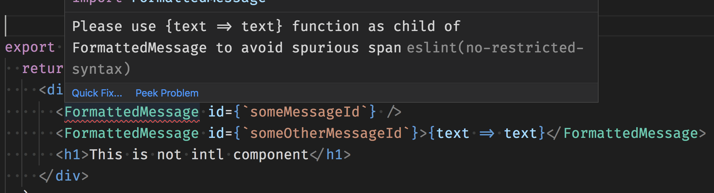

# Abstract Syntax Tree (AST) experiments - neither fun, nor profitable!

Well, they are a little fun, probably only profitable in the right circumstances.

## Pre-requisites

I used node 10.15.1 - you probably should too. All you need then is to `npm install` and you're away to the races

# What's happening here

This repo contains demo code for an article on Abstract Syntax Trees : https://www.webpusher.ie/2019/02/06/ast-series

The code demonstrates examples of manipulating Abstract Syntax Trees (AST) using the `babel` javascript compiler.

## Examples

There are a few examples included

- var to const
- arrayToObject

To run each example, use the provided `compile.js` file which loads the source file, the specified plugin and prints the resulting transpiled code to the console.

For example, to run the `varToConst` transform use the command below. The convention is that the plugin name will match the folder name, and the compiler will assume the source files are in the same folder.

```bash
node compile.js varToConst vars.source.js
```

Which will produce the following result

```text
Source code (./varToConst/vars.source.js)
===============
// this 'var' should be replaced with a 'const'
var itemOne = ['items', 'things', 'gizmos', 'widgets'];

// this will stay a 'let'
let itemTwo = ['tchotchke', 'stuff', 'yokes'];

Compiled code using "./varToConst/varToConst.js" plugin
==============
// this 'var' should be replaced with a 'const'
const itemOne = ['items', 'things', 'gizmos', 'widgets'];

// this will stay a 'let'
let itemTwo = ['tchotchke', 'stuff', 'yokes'];
```

Notice the `var` has been updated to a `const`

## ESlint rules with AST selectors

The example here accompanies an article on [AST Selectors](https://webpusher.ie//2019/04/28/ast-selectors-rule)

### The code sample

The code sample is a contrived React component

```javascript
import React from 'react';
import FormattedMessage from 'react-intl';

export const basic = () => {
  return (
    <div>
      <FormattedMessage id={`someMessageId`} />
      <FormattedMessage id={`someOtherMessageId`}>{text => text}</FormattedMessage>
      <h1>This is not intl component</h1>
    </div>
  );
};
```

The example AST selector is intended to highlight any `FormattedMessage` components that do not contain an anonymous function. The anonymous function is intended to avoid the message being wrapped in a `span`.

The AST selector shown below is added to the `no-restricted-syntax` rules in eslint config and should highlight the first `FormattedMessage` as an error by ESlint in your IDE. The second `FormattedMessage` will not be highlighted as an error.

```json
"no-restricted-syntax": [
  "error", {
    "selector": "JSXElement[children=''] JSXOpeningElement JSXIdentifier[name='FormattedMessage']",
    "message": "Please use {text => text} function as child of FormattedMessage to avoid spurious span"
  },
]
```

The resulting error message displayed in VS Code is shown below.

